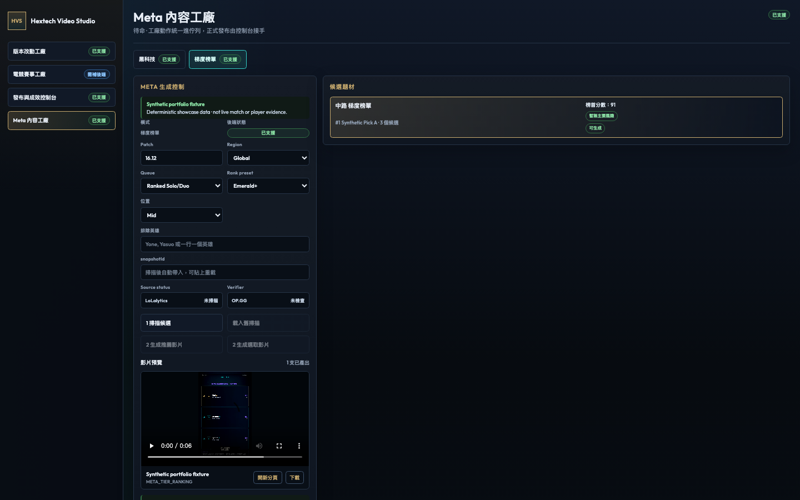

# Hextech Video Studio

一套把《英雄聯盟》版本資料與電競賽事資訊轉成雙語短影音的內容工廠。它將資料掃描、候選評分、腳本規劃、Remotion 算圖、發布佇列與成效追蹤整合在同一個 Next.js 工作台。



## 作品集重點

- **資料到影片的完整管線**：版本掃描 → 內容候選 → 中英文腳本 → Remotion 影片 → 發布佇列。
- **四個工作區**：版本改動、電競賽事、Meta 內容工廠、發布與成效控制台。
- **發布安全閘門**：素材不完整、資料來源降級或影片不存在時會阻止正式發布。
- **可重跑的本機資料層**：snapshot、queue 與 insight store 支援失敗復原與排程。
- **測試保護**：unit、API boundary、render 與 opt-in live contract tests。

## 架構

```text
app/                 Next.js 工作台與 API routes
utils/contentFactory 版本內容解析、雙語 payload、內容庫
utils/esports         賽事聚合、評分、腳本與 gatekeeper
utils/metaFactory     Meta 候選、來源 adapter 與 snapshot
utils/publishing      Instagram / Threads 佇列、OAuth、insights
utils/render          遠端素材快取與 Remotion render service
src/templates         版本、賽事、Meta 等短影音模板
tests/                unit、boundary 與 live contract tests
```

## 本機 Demo

```bash
npm ci
cp .env.example .env.local
npm run dev
```

開啟 `http://localhost:3000`。不設定第三方金鑰也能瀏覽工作台與執行測試；實際 AI 分析、社群 OAuth、發布與遠端資料契約需要各服務的合法憑證。

建議展示流程：

1. 在「版本改動工廠」切換英雄、系統、裝備／符文模式。
2. 掃描或載入內容庫，選擇一筆候選內容。
3. 產生雙語影片並從預覽區檢查結果。
4. 到發布控制台查看排程與成效同步狀態。

## 驗證

```bash
npm test
npm run verify
```

外部資料來源的真實邊界測試預設不執行，避免日常測試依賴第三方可用性：

```bash
RUN_EXTERNAL_CONTRACTS=1 npm test -- tests/contract/metaFactory/lolalyticsContract.test.js
```

## 安全與發布邊界

- 所有 API key、OAuth secret、refresh token 與 access token 只從 `.env.local`／環境變數讀取，且不進版。
- `.env.example` 只列出空白設定名稱；預設 YouTube 與 TikTok 隱私狀態為私人／僅自己。
- 正式發布前會檢查影片檔案、公開媒體 URL、資料完整度與支援的平台。
- Remotion 透過參數陣列與 `shell: false` 啟動，composition 只由 `dataType` 固定對照表選取，不接受呼叫端傳入命令片段。
- Production 的所有 `POST /api/*` 都需要 `X-Operator-Token`，並以 `PORTFOLIO_OPERATOR_TOKEN` 做固定時間比較；未設定時採 fail closed。
- 公開作品集應設定 `NEXT_PUBLIC_PORTFOLIO_READ_ONLY=true`，介面會清楚標示展示模式並停用 render、scan、publish 等寫入／計算操作；GET 型的佇列與成果瀏覽仍可使用。
- 本機 render、發布包、快取、log 與 insight store 均由 `.gitignore` 排除。

Production 變數只放在部署平台，不要把值寫入 Git：

```bash
NEXT_PUBLIC_PORTFOLIO_READ_ONLY=true
PORTFOLIO_OPERATOR_TOKEN=<密碼管理器產生的長隨機值>
```

管理者若要直接呼叫 production API，需從安全的 server-side 工具加入 `X-Operator-Token`；瀏覽器端程式不保存也不回傳這組 Token。本機 `npm run dev` 不受此限制，原有創作流程維持不變。

## 技術棧

Next.js 16、React 19、Remotion 4、Node.js test runner、Google Generative AI、Meta Graph API、YouTube API。

## Disclaimer

這是非官方作品集專案，與 Riot Games 無隸屬或背書關係。《英雄聯盟》及相關商標屬其各自權利人；使用者應自行確認資料來源、遊戲素材與社群平台的授權條款。

## License

ISC
