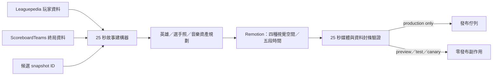

# 25 秒「賽後判讀」戰局解析實作計畫

> **For agentic workers:** REQUIRED SUB-SKILL: Use `superpowers:executing-plans` to execute this plan task-by-task. The project owner explicitly requires inline execution only: do not use subagents.

**目標：** 將現有 12 秒、360 frames 的 `賽後判讀 / POST MATCH READ` 升級為已核可的 25 秒版本：一般玩家依序看懂結果、關鍵對位、遊戲過程、數據 MVP 候選與最後判讀；保留既有 API／composition 相容名稱，並維持資料誠實、媒體驗證與零佇列污染。

**架構：** Leaguepedia 的玩家資料與 `ScoreboardTeams` 終局隊伍資料先在 Node 資料層正規化，再由純函式建立完整 `postMatchRead` view model。資產層只解析已驗證的 Data Dragon 英雄方形頭像、可選氣氛原畫、追蹤於 repo 的選手照片與 25 秒授權音樂片段。Remotion 只讀已解析資料並負責四種視覺空間／五段時間軸；任何 production 發布任務都必須等 25 秒媒體閘門通過後才可建立。

**技術棧：** Node.js CommonJS services、`node:test`、React 19、Remotion 4.0.489、Leaguepedia Cargo API、Riot Data Dragon、FFmpeg／ffprobe、repository-hosted OFL fonts、現有三首授權 MP3、Git／GitHub Actions。

## 產品結果與資料流

完成後，觀眾看到的不是「一堆比賽數字」，而是固定的理解順序：`GEN 2–0 HLE → Chovy 中路每分鐘經濟優勢 → 資源如何變成塔與地圖 → Ruler 為數據 MVP 候選 → 一句可記住的判讀`。



## 全域限制與驗收定義

- 全程 inline 執行；不得使用子代理。
- 嚴格逐一垂直 TDD：一次新增一個失敗測試，親眼確認失敗原因，再做最小實作、跑綠、重構。不可先堆多個測試再一起實作。
- 保留內部 `PLAYER_RADAR`、`PlayerRadarVideo`、`/api/esports/player-radar`；觀眾端只顯示 `賽後判讀 / POST MATCH READ`。
- 固定 1080×1920、30fps、750 frames／25.0 秒；不得有舊 lead-in 或 final buffer。
- `ScoreboardTeams` 只有終局 totals，`gameFlow.hasEventTimestamps` 固定 `false`；不得產生分鐘數、路徑、會戰位置或逐事件因果。
- 英雄方形頭像是必要身份資產；splash 只可選配作低對比氣氛。方形頭像失敗即阻擋 render。
- 選手照片必須通過 player／team／season／SHA-256／尺寸 manifest 驗證；不得用英雄圖、AI 人像或 placeholder 替代。
- 僅沿用三首既有授權音樂；12 秒 safe segment 對 25 秒成品無效。
- preview、test、dry-run、canary 永遠不得寫 production queue、daily runs、publish packages 或社群平台。
- 動態每段最多兩個主事件；23.5 秒（frame 705）後所有視覺值必須不再改變。
- 前端／動態施工時套用 `frontend-design`、`emil-design-eng`、`ui-ux-pro-max`、`review-animations`；以核可稿為視覺來源，不另選風格。
- 每個 task commit 前交付產品理解檢查點：能力、使用者體驗、技術結構、資料流、設計理由、備援、安全／成本、測試證據、剩餘限制。
- 全部 task 完成才跑一次 repository 全套；合併 `main` 後再跑一次。不可用局部測試推論全套通過。

---

### Task 0：建立可回復且不碰正式資料的施工基線

**檔案：**

- Read: `HANDOFF.md`
- Read: `docs/superpowers/specs/2026-08-13-post-match-read-25s-game-flow-design.md`
- Read: 本計畫
- 本 task 不修改 runtime data

- [ ] **Step 1：確認目前只有核可文件領先遠端**

執行：

```bash
git status --short --branch
git log --oneline --decorate -6
git diff --check origin/main...HEAD
```

預期：worktree clean；`main` 只包含已核可規格與本計畫的文件提交，沒有 source 或 runtime 未提交內容。

- [ ] **Step 2：建立正式資料封條**

執行：

```bash
node - <<'NODE'
const crypto = require("node:crypto");
const fs = require("node:fs");
for (const file of [
  ".data/patch-content-db.json",
  ".data/publish-queue.json",
  ".data/esports-daily-runs.json",
]) {
  const value = fs.existsSync(file)
    ? crypto.createHash("sha256").update(fs.readFileSync(file)).digest("hex")
    : "MISSING";
  console.log(`${file}\t${value}`);
}
const packageCount = fs.existsSync("public/publish-packages")
  ? fs.readdirSync("public/publish-packages").length
  : 0;
console.log(`public/publish-packages\t${packageCount}`);
NODE
```

把輸出記在執行紀錄。預期 queue／daily runs 為 `MISSING` 或既有固定 hash，publish packages 為 0；任何不一致先停止，不能把正式內容變動誤認為測試輸出。

- [ ] **Step 3：建立隔離實作分支**

```bash
git switch -c codex/post-match-read-25s
git status --short --branch
```

預期：目前分支為 `codex/post-match-read-25s`，worktree clean。

---

### Task 1：以正式 `ScoreboardTeams` 契約取得隊伍終局資料

**檔案：**

- Modify: `utils/leaguepediaApi.js`
- Modify: `tests/unit/leaguepediaApiCooldown.test.js`
- Create: `tests/integration/esports/leaguepediaScoreboardTeams.test.js`

- [ ] **Step 1：RED — Cargo query 必須要求正確的隊伍欄位**

在 `tests/unit/leaguepediaApiCooldown.test.js` 新增一個 fetch stub；一次只新增這個行為：

```js
test("fetchMatchTeamStats requests and normalizes ScoreboardTeams final fields", async () => {
  const originalFetch = global.fetch;
  let requestedFields = "";
  global.fetch = async (url) => {
    const parsed = new URL(url);
    assert.equal(parsed.searchParams.get("tables"), "ScoreboardTeams");
    requestedFields = parsed.searchParams.get("fields") || "";
    return {
      ok: true,
      headers: { get: () => "" },
      json: async () => ({ cargoquery: [{ title: {
        GameId: "game-1", Team: "Gen.G", Side: "Blue", IsWinner: "1",
        Dragons: "3", Barons: "1", Towers: "8", Gold: "77,031",
        Kills: "15", RiftHeralds: "0", VoidGrubs: "0",
      } }] }),
    };
  };
  try {
    const rows = await leaguepedia.fetchMatchTeamStats("game-1");
    for (const field of ["Dragons", "Barons", "Towers", "Gold", "Kills", "RiftHeralds", "VoidGrubs", "GameId"]) {
      assert.match(requestedFields, new RegExp(`ScoreboardTeams\\.${field}`));
    }
    assert.deepEqual(rows[0], {
      gameId: "game-1", team: "Gen.G", side: "Blue", isWinner: true,
      dragons: 3, barons: 1, towers: 8, gold: 77031, kills: 15,
      riftHeralds: 0, voidGrubs: 0,
      source: "ScoreboardTeams", snapshotType: "team-final", hasEventTimestamps: false,
    });
  } finally {
    global.fetch = originalFetch;
    leaguepedia.clearSession();
  }
});
```

執行：

```bash
node --test tests/unit/leaguepediaApiCooldown.test.js --test-name-pattern="fetchMatchTeamStats requests"
```

預期：FAIL，原因為 `fetchMatchTeamStats is not a function`。

- [ ] **Step 2：GREEN — 加入最小正規化器與 fetcher**

在 `utils/leaguepediaApi.js` 加入以下 public contract：

```js
function optionalInteger(value) {
  if (value === null || value === undefined || String(value).trim() === "") return null;
  const parsed = Number(String(value).replaceAll(",", ""));
  return Number.isFinite(parsed) ? parsed : null;
}

function normalizeTeamRow(row = {}) {
  return {
    gameId: String(row.GameId || ""),
    team: String(row.Team || ""),
    side: String(row.Side || ""),
    isWinner: ["1", "true"].includes(String(row.IsWinner || "").toLowerCase()),
    dragons: optionalInteger(row.Dragons),
    barons: optionalInteger(row.Barons),
    towers: optionalInteger(row.Towers),
    gold: optionalInteger(row.Gold),
    kills: optionalInteger(row.Kills),
    riftHeralds: optionalInteger(row.RiftHeralds),
    voidGrubs: optionalInteger(row.VoidGrubs),
    source: "ScoreboardTeams",
    snapshotType: "team-final",
    hasEventTimestamps: false,
  };
}

async function fetchMatchTeamStats(gameId) {
  const safeGameId = String(gameId || "").replaceAll("'", "''");
  const rows = await cargoQuery({
    tables: "ScoreboardTeams",
    fields: [
      "ScoreboardTeams.GameId", "ScoreboardTeams.Team", "ScoreboardTeams.Side",
      "ScoreboardTeams.IsWinner", "ScoreboardTeams.Dragons", "ScoreboardTeams.Barons",
      "ScoreboardTeams.Towers", "ScoreboardTeams.Gold", "ScoreboardTeams.Kills",
      "ScoreboardTeams.RiftHeralds", "ScoreboardTeams.VoidGrubs",
    ].join(","),
    where: `ScoreboardTeams.GameId='${safeGameId}'`,
    limit: 2,
  });
  return rows.map(normalizeTeamRow);
}
```

同時 export `fetchMatchTeamStats`、`normalizeTeamRow`。重跑 focused test，預期 PASS。

- [ ] **Step 3：RED → GREEN — 空值不能被假裝成 0**

新增一個測試，餵入 `Gold: ""`、缺少 `VoidGrubs`，斷言兩者是 `null` 而不是 0。先執行看到 FAIL；若 Step 2 已自然通過，先暫時以舊 `Number("")` 實作重現紅燈，再恢復 `optionalInteger` 最小修正，確保測試真的能抓到資料造假。

- [ ] **Step 4：補真實邊界 contract**

建立 `tests/integration/esports/leaguepediaScoreboardTeams.test.js`：

```js
const test = require("node:test");
const assert = require("node:assert/strict");
const { fetchMatchTeamStats } = require("../../../utils/leaguepediaApi");

test("Leaguepedia ScoreboardTeams returns two team-final rows", {
  skip: !process.env.LEAGUEPEDIA_SCOREBOARD_GAME_ID,
}, async () => {
  const rows = await fetchMatchTeamStats(process.env.LEAGUEPEDIA_SCOREBOARD_GAME_ID);
  assert.equal(rows.length, 2);
  assert.equal(new Set(rows.map((row) => row.team)).size, 2);
  assert.equal(rows.every((row) => row.source === "ScoreboardTeams"), true);
  assert.equal(rows.every((row) => row.hasEventTimestamps === false), true);
  assert.equal(rows.some((row) => Number.isFinite(row.towers)), true);
  assert.equal(rows.some((row) => Number.isFinite(row.gold)), true);
});
```

預設全套允許因缺少明確 game ID 而 skip；canary 前以實際 frozen game ID 執行一次，不可以 mock 取代這個真實 response-shape 驗證。

- [ ] **Step 5：重構與 commit**

```bash
node --test tests/unit/leaguepediaApiCooldown.test.js tests/integration/esports/leaguepediaScoreboardTeams.test.js
git diff --check
git add utils/leaguepediaApi.js tests/unit/leaguepediaApiCooldown.test.js tests/integration/esports/leaguepediaScoreboardTeams.test.js
git commit -m "feat: ingest Leaguepedia team final stats"
```

---

### Task 2：把每局隊伍證據保存到候選 snapshot，而不是在模板臨時查詢

**檔案：**

- Modify: `utils/esports/seriesFetcher.js`
- Modify: `utils/esports/seriesAggregator.js`
- Modify: `tests/unit/esports/seriesFetcher.test.js`
- Modify: `tests/unit/esports/seriesAggregator.test.js`

- [ ] **Step 1：RED — fetcher 應把兩筆 team-final rows 放進對應 game**

在 `seriesFetcher.test.js` 新增單一測試，注入 `fetchMatchTeamStats` 並斷言：

```js
assert.deepEqual(candidates[0].games[0].teamFinalStats, [
  { gameId: "lck-g1", team: "GEN", towers: 8, gold: 77031 },
  { gameId: "lck-g1", team: "HLE", towers: 4, gold: 68114 },
]);
```

執行 focused test，預期 FAIL：`teamFinalStats` 目前不存在。

- [ ] **Step 2：GREEN — 每局在玩家 detail 後循序讀一次隊伍資料**

在 `normalizeGame()` 回傳：

```js
teamFinalStats: Array.isArray(detail.teamFinalStats) ? detail.teamFinalStats : [],
```

在 `fetchCompletedSeriesForDate()` 加入 dependency：

```js
const fetchMatchTeamStats = deps.fetchMatchTeamStats || leaguepedia.fetchMatchTeamStats;
```

並在 `fetchMatchPlayers()` 成功後循序執行：

```js
const gameId = match.gameId || match.GameId || match.uniqueGame;
const detail = await fetchMatchPlayers(gameId);
if (!detail) continue;
const teamFinalStats = await fetchMatchTeamStats(gameId);
const game = normalizeGame({ ...detail, teamFinalStats });
```

不平行打兩個 Cargo request，以免惡化既有 Fandom 限流。重跑 focused test，預期 PASS。

- [ ] **Step 3：RED — aggregation 必須保留 game number 與原始 team-final records**

在 `seriesAggregator.test.js` 的兩局 fixture 各加入 `teamFinalStats`，然後斷言：

```js
assert.equal(series.gameTeamStats.length, 2);
assert.equal(series.gameTeamStats[0].gameNumber, 1);
assert.equal(series.gameTeamStats[0].gameId, "game-1");
assert.equal(series.gameTeamStats[0].teams[0].snapshotType, "team-final");
assert.equal(series.gameTeamStats[0].hasEventTimestamps, false);
```

預期 FAIL：aggregated series 目前只保存 `games: 2`，沒有逐局證據。

- [ ] **Step 4：GREEN — 加入明確的 `gameTeamStats`，保留 `games` 數字相容欄位**

在 `aggregateSeries()` return 前建立：

```js
const gameTeamStats = games.map((game, index) => ({
  gameNumber: index + 1,
  gameId: game.gameId || game.GameId || "",
  winningTeam: game.winTeam || game.WinTeam || "",
  hasEventTimestamps: false,
  teams: Array.isArray(game.teamFinalStats) ? game.teamFinalStats.map((team) => ({ ...team })) : [],
}));
```

在 return object 加入 `gameTeamStats`，保留既有 `games: games.length`，避免下游 API 被無關破壞。focused tests 應全綠。

- [ ] **Step 5：錯誤備援測試**

新增一個 game 沒有 `teamFinalStats` 的測試，斷言 aggregation 仍成功、`teams: []`、`hasEventTimestamps: false`。這只允許候選建立；後續故事建構器會依規格決定簡化或阻擋 render。

- [ ] **Step 6：commit**

```bash
node --test tests/unit/esports/seriesFetcher.test.js tests/unit/esports/seriesAggregator.test.js
git diff --check
git add utils/esports/seriesFetcher.js utils/esports/seriesAggregator.js tests/unit/esports/seriesFetcher.test.js tests/unit/esports/seriesAggregator.test.js
git commit -m "feat: preserve per-game team evidence"
```

---

### Task 3：建立 750-frame、角色感知且可追溯的五段故事模型

**檔案：**

- Modify: `utils/esports/postMatchReadBuilder.js`
- Modify: `utils/esports/playerRadarRunner.js`
- Modify: `tests/unit/esports/postMatchReadBuilder.test.js`
- Modify: `tests/unit/esports/playerRadarRunner.test.js`

- [ ] **Step 1：RED — 故事板必須正好是五段 750 frames**

先把現有 storyboard 測試改為：

```js
assert.deepEqual(viewModel.storyboard.map(({ tag, durationInFrames }) => [tag, durationInFrames]), [
  ["RESULT_HOOK", 120],
  ["MATCHUP_EDGE", 150],
  ["GAME_FLOW", 240],
  ["PLAYER_PROOF", 150],
  ["FINAL_READ", 90],
]);
assert.equal(viewModel.storyboard.reduce((sum, scene) => sum + scene.durationInFrames, 0), 750);
```

執行：

```bash
node --test tests/unit/esports/postMatchReadBuilder.test.js --test-name-pattern="750"
```

預期 FAIL：目前仍為 4 tags／360 frames。

- [ ] **Step 2：GREEN — 只先替換時間契約**

```js
const POST_MATCH_READ_STORYBOARD = Object.freeze([
  { tag: "RESULT_HOOK", durationInFrames: 120 },
  { tag: "MATCHUP_EDGE", durationInFrames: 150 },
  { tag: "GAME_FLOW", durationInFrames: 240 },
  { tag: "PLAYER_PROOF", durationInFrames: 150 },
  { tag: "FINAL_READ", durationInFrames: 90 },
]);
```

此步先讓時間測試通過，不同時實作 game flow。

- [ ] **Step 3：RED — Mid 對位不能殘留「打野」硬編碼**

新增 Mid fixture，斷言：

```js
assert.equal(model.matchup.role, "Mid");
assert.equal(model.matchup.primaryEvidence.displayValue, "+72 GPM");
assert.equal(model.matchup.claim, "不是一波打贏。是每分鐘都在擴大差距。");
assert.doesNotMatch(JSON.stringify(model), /打野拉開|下路把優勢/);
```

預期 FAIL：舊 `PUBLIC_COPY` 仍含打野／下路固定句。

- [ ] **Step 4：GREEN — 集中角色文案與 primary evidence**

建立明確 role copy，而不是在 React 判斷：

```js
const ROLE_READS_ZH = Object.freeze({
  Top: "上路把對線資源換成邊線壓力。",
  Jungle: "打野把資源控制換成地圖節奏。",
  Mid: "不是一波打贏。是每分鐘都在擴大差距。",
  Adc: "下路把穩定經濟換成持續輸出。",
  Support: "輔助把視野與參戰換成開戰主導權。",
});

function buildMatchupPrimaryEvidence(matchup = {}) {
  const reason = (matchup.reasons || [])[0] || {};
  const delta = Number(reason.delta);
  if (!reason.metric || !Number.isFinite(delta) || delta <= 0) {
    throw new Error("Post Match Read matchup requires a positive primary evidence delta.");
  }
  return {
    metric: reason.metric,
    winnerValue: Number(reason.winnerValue),
    loserValue: Number(reason.loserValue),
    delta,
    displayValue: `+${delta} ${reason.metric}`,
  };
}
```

`buildPostMatchReadViewModel()` 使用 `ROLE_READS_ZH[role]`；未知 role 直接 throw，不回退到 Jungle。

- [ ] **Step 5：RED — 以 Game 1 終局資料建立誠實 game flow**

新增核可 fixture：

```js
series.gameTeamStats = [{
  gameNumber: 1,
  gameId: "gen-hle-g1",
  winningTeam: "GEN",
  hasEventTimestamps: false,
  teams: [
    { team: "HLE", voidGrubs: 3, riftHeralds: 1, barons: 0, towers: 4, gold: 68114, source: "ScoreboardTeams", snapshotType: "team-final" },
    { team: "GEN", voidGrubs: 0, riftHeralds: 0, barons: 1, towers: 8, gold: 77031, source: "ScoreboardTeams", snapshotType: "team-final" },
  ],
}];

assert.deepEqual(model.gameFlow, {
  gameNumber: 1,
  gameId: "gen-hle-g1",
  earlyResourceTeam: "HLE",
  finalMapTeam: "GEN",
  earlyResources: { voidGrubs: 3, riftHeralds: 1, displayValue: "3＋1" },
  conversion: { barons: 1, towers: 8, displayValue: "1 → 8" },
  goldDelta: 8917,
  towerScore: "8–4",
  teamFinals: series.gameTeamStats[0].teams,
  analysisClaim: "HLE 拿到前期資源，GEN 最後拿走地圖。",
  conclusion: "物件本身不是勝點，物件之後換到幾座塔才是。",
  claimBasis: {
    source: "ScoreboardTeams",
    snapshotType: "team-final",
    fields: ["VoidGrubs", "RiftHeralds", "Barons", "Towers", "Gold"],
    hasEventTimestamps: false,
  },
});
```

預期 FAIL：`gameFlow` 不存在。

- [ ] **Step 6：GREEN — 純函式推導 Game 1 後設判讀**

加入 `buildGameFlow(series)`；選第一個擁有兩隊、`VoidGrubs/RiftHeralds` 與 `Barons/Towers/Gold` 可驗證值的 game。`earlyResourceTeam` 以 `voidGrubs + riftHeralds` 較高者決定；`finalMapTeam` 必須是 winning team 且 towers 較高者。若條件不成立，throw：

```js
throw new Error("Post Match Read requires two-team final objective evidence for game flow.");
```

公開句只能使用上方固定的「拿到前期資源／最後拿走地圖」，不可拼入分鐘數。

- [ ] **Step 7：RED → GREEN — 沒有事件時間戳時拒絕精確事件敘事**

新增測試，將任何 `analysisClaim` 設成 `18:00 巴龍團` 或含 `→ 上路` 路徑後交給 builder，預期 throw `/event timestamp|precise path/i`。最小實作以集中 validator 拒絕：

```js
const PRECISE_EVENT_PATTERN = /\b\d{1,2}:\d{2}\b|→\s*(?:上路|中路|下路|top|mid|bot)/i;
```

一般資料 `1 → 8` 不得被誤擋，因此 validator 只檢查公開敘事欄位，不檢查數值 display。

- [ ] **Step 8：RED — result hook 與 final read 只能回顧已出現資料**

新增斷言：

```js
assert.deepEqual(model.resultHook.scoreParts, { left: "2", separator: "–", right: "0" });
assert.equal(model.finalRead.conclusion, "GEN 的勝點不是搶得多，而是把每次領先換成塔與輸出。");
assert.deepEqual(model.finalRead.recapReferences, [
  { source: "matchup", metric: "GPM", displayValue: "+72 GPM" },
  { source: "proof", metric: "CSM", displayValue: "9.88 CSM" },
]);
```

證明 `proof.player.rawStats.csm` 為 9.88；若 proof 沒有 CSM，builder 必須停止，不能把別的 metric 改名成 CSM。

- [ ] **Step 9：GREEN — 完成公開 view model contract**

`buildPostMatchReadViewModel()` 最終只能回傳以下責任區塊：

```js
{
  branding,
  seriesContext: { league, seriesId, snapshotId, season, teamA, teamB, score, gameCount, scopeLabel },
  resultHook,
  matchup,
  gameFlow,
  proof,
  finalRead,
  assets: {},
  audioPlan: null,
  storyboard,
}
```

在 `runPlayerRadarFromSnapshot()` 的 selection 加入 `snapshotId: snapshot.scanId`；`buildPlayerRadarPayload()` 不改 public signature，只把它傳進 builder。

- [ ] **Step 10：focused regression 與 commit**

```bash
node --test tests/unit/esports/postMatchReadBuilder.test.js tests/unit/esports/playerRadarRunner.test.js
git diff --check
git add utils/esports/postMatchReadBuilder.js utils/esports/playerRadarRunner.js tests/unit/esports/postMatchReadBuilder.test.js tests/unit/esports/playerRadarRunner.test.js
git commit -m "feat: build the 25-second post match story"
```

---

### Task 4：讓 evidence validator 保護五段資料，不只檢查畫面有欄位

**檔案：**

- Modify: `utils/esports/playerRadarEvidence.js`
- Modify: `tests/unit/apiBoundaryContracts.test.js`
- Modify: `tests/unit/esports/playerRadarRunner.test.js`

- [ ] **Step 1：RED — 舊四幕／360-frame payload 必須被拒絕**

將 `makeValidPlayerRadarAnalysis()` fixture 更新成 Task 3 的五個區塊，但先保留 360-frame storyboard；新增斷言：

```js
assert.throws(
  () => validatePlayerRadarAnalysis(analysis),
  /storyboard must total 750 frames/i,
);
```

預期 FAIL：現有 validator 仍把 360 當成合法值。

- [ ] **Step 2：GREEN — 驗證 exact tags 與 750 frames**

把 exact tag order 改為：

```js
const EXPECTED_POST_MATCH_READ_TAGS = [
  "RESULT_HOOK", "MATCHUP_EDGE", "GAME_FLOW", "PLAYER_PROOF", "FINAL_READ",
];
const POST_MATCH_READ_TOTAL_FRAMES = 750;
```

Validator 必須同時比較 tag、每段 positive integer duration 與總和；不得只驗證總和。

- [ ] **Step 3：RED — game flow totals 被竄改時要失敗**

建立 valid analysis 後改 `gameFlow.goldDelta` 為 9000，保留 team gold 77031／68114，斷言 validator throw `/gold delta.*team-final/i`。

- [ ] **Step 4：GREEN — 重新計算而非相信 display value**

加入純驗證：

```js
function gameFlowMatchesTeamFinals(gameFlow = {}) {
  const teams = gameFlow.teamFinals || [];
  if (teams.length !== 2 || gameFlow.claimBasis?.hasEventTimestamps !== false) return false;
  const byTeam = new Map(teams.map((team) => [team.team, team]));
  const winner = byTeam.get(gameFlow.finalMapTeam);
  const other = teams.find((team) => team.team !== gameFlow.finalMapTeam);
  if (!winner || !other) return false;
  return Number(winner.gold) - Number(other.gold) === Number(gameFlow.goldDelta)
    && `${winner.towers}–${other.towers}` === gameFlow.towerScore
    && Number(winner.barons) === Number(gameFlow.conversion?.barons)
    && Number(winner.towers) === Number(gameFlow.conversion?.towers);
}
```

`postMatchReadBuilder` 的 `gameFlow` 要保留 `teamFinals` 原始陣列供證據驗證；template 不必顯示所有欄位。

- [ ] **Step 5：RED → GREEN — final recap 不得引入新數據**

把 recap 改成 `+99 KDA`，預期 validator 拒絕。實作必須逐條比對：

- `source: "matchup"` 必須與 `matchup.primaryEvidence.metric/displayValue` 相同。
- `source: "proof"` 必須可從 `proof.player.rawStats` 重新算出相同 display。
- recapReferences 正好兩條，不能重複 source。

- [ ] **Step 6：runner 邊界回歸與 commit**

```bash
node --test tests/unit/apiBoundaryContracts.test.js tests/unit/esports/playerRadarRunner.test.js
git diff --check
git add utils/esports/playerRadarEvidence.js tests/unit/apiBoundaryContracts.test.js tests/unit/esports/playerRadarRunner.test.js
git commit -m "test: guard the five-beat evidence chain"
```

---

### Task 5：建立已授權選手照片 manifest，正確驗證 Ruler 身份與檔案

**檔案：**

- Create: `config/esports-player-portraits.json`
- Create: `utils/render/playerPortraitManifest.js`
- Create: `tests/unit/render/playerPortraitManifest.test.js`
- Create: `public/player-portraits/gen-ruler-2026.webp`
- Modify: `THIRD_PARTY_ASSETS.md`

- [ ] **Step 1：RED — 正確 Ruler manifest 尚無法解析**

建立 focused test：

```js
const test = require("node:test");
const assert = require("node:assert/strict");
const path = require("node:path");
const { resolvePlayerPortrait } = require("../../../utils/render/playerPortraitManifest");

test("resolvePlayerPortrait verifies Ruler 2026 GEN identity and tracked bytes", () => {
  const resolved = resolvePlayerPortrait({
    playerId: "ruler", publicName: "Ruler", team: "GEN", season: "2026",
  }, { rootDir: path.resolve(__dirname, "../../..") });
  assert.equal(resolved.publicPath, "/player-portraits/gen-ruler-2026.webp");
  assert.equal(resolved.width, 693);
  assert.equal(resolved.height, 549);
  assert.equal(resolved.sha256, "9b10b93cc8368c90c82dd1381151931e6f857a4beb6a34e46469ea6aee9d558d");
});
```

預期 FAIL：module／asset／manifest 都尚不存在。

- [ ] **Step 2：GREEN — 下載核可 bytes 並建立明確 manifest**

下載時先寫入 temp file、核對 SHA 與尺寸後才移到 repo：

```bash
portrait_temp="$(mktemp)"
curl -fsSL 'https://static.wikia.nocookie.net/lolesports_gamepedia_en/images/e/e3/GEN_Ruler_2026_Split_1.png/revision/latest?cb=20260122171312' -o "$portrait_temp"
printf '%s  %s\n' '9b10b93cc8368c90c82dd1381151931e6f857a4beb6a34e46469ea6aee9d558d' "$portrait_temp" | shasum -a 256 -c -
sips -g pixelWidth -g pixelHeight -g format "$portrait_temp"
mkdir -p public/player-portraits
mv "$portrait_temp" public/player-portraits/gen-ruler-2026.webp
```

預期：693×549、WebP。`config/esports-player-portraits.json` 使用以下完整 entry：

```json
{
  "version": 1,
  "portraits": [{
    "playerId": "ruler",
    "publicName": "Ruler",
    "team": "Gen.G",
    "teamAliases": ["GEN", "Gen.G"],
    "season": "2026",
    "sourceUrl": "https://static.wikia.nocookie.net/lolesports_gamepedia_en/images/e/e3/GEN_Ruler_2026_Split_1.png/revision/latest?cb=20260122171312",
    "licenseNote": "Project owner confirmed player portraits are authorized for video use and redistribution in this GitHub repository on 2026-08-13.",
    "sha256": "9b10b93cc8368c90c82dd1381151931e6f857a4beb6a34e46469ea6aee9d558d",
    "width": 693,
    "height": 549,
    "verifiedAt": "2026-08-13T00:00:00Z",
    "repositoryPath": "public/player-portraits/gen-ruler-2026.webp"
  }]
}
```

- [ ] **Step 3：GREEN — resolver 同時驗證身份、路徑、hash 與尺寸**

`resolvePlayerPortrait(identity, options)` 的 contract：

```js
{
  playerId, publicName, team, season, sourceUrl, licenseNote,
  sha256, width, height,
  publicPath: "/player-portraits/gen-ruler-2026.webp",
}
```

Resolver 必須：

1. 以 case-insensitive `playerId` 或公開名尋找唯一 entry。
2. team 必須符合 canonical team 或 alias；season 必須相同。
3. `repositoryPath` 解析後必須 confinement 在 `path.resolve(rootDir, "public", "player-portraits")`。
4. 檔案存在且為 regular file。
5. 實際 SHA-256、WebP dimensions 必須等於 manifest。
6. 任一不符 throw 可操作錯誤，例如 `Player portrait team mismatch for Ruler: expected Gen.G, received HLE.`

- [ ] **Step 4：RED → GREEN — 錯人、錯隊與 hash mismatch 都不能降級**

一次加入一個 test 並逐一跑紅→綠：

```js
assert.throws(() => resolvePlayerPortrait({ publicName: "Ruler", team: "HLE", season: "2026" }, options), /team mismatch/i);
assert.throws(() => resolvePlayerPortrait({ publicName: "Unknown", team: "GEN", season: "2026" }, options), /not found/i);
assert.throws(() => resolvePlayerPortrait(validIdentity, { ...options, manifest: tamperedHashManifest }), /SHA-256 mismatch/i);
```

- [ ] **Step 5：補第三方資產聲明與 commit**

`THIRD_PARTY_ASSETS.md` 記錄來源 URL、使用者授權確認日期、repo path、693×549、WebP、SHA-256；不得含「官方 LCK 授權」等使用者沒有說過的擴張宣稱。

```bash
node --test tests/unit/render/playerPortraitManifest.test.js
git diff --check
git add config/esports-player-portraits.json utils/render/playerPortraitManifest.js tests/unit/render/playerPortraitManifest.test.js public/player-portraits/gen-ruler-2026.webp THIRD_PARTY_ASSETS.md
git commit -m "feat: verify licensed player portraits"
```

---

### Task 6：英雄方形臉改為必要資產，splash 降為可選氣氛

**檔案：**

- Modify: `utils/render/playerRadarAssetPlanner.js`
- Modify: `tests/unit/render/playerRadarAssetPlanner.test.js`
- Modify: `utils/render/renderService.js`
- Modify: `tests/unit/render/renderService.test.js`

- [ ] **Step 1：RED — splash 成功但 square 失敗仍應阻擋 render**

把舊「splash 或 square 任一成功」測試改為：

```js
await assert.rejects(
  () => resolvePlayerRadarAssets(makeViewModel(), {
    cache: async (url) => url.includes("/img/champion/") && !url.includes("/splash/")
      ? RENDER_ASSET_FALLBACK_PUBLIC_PATH
      : "/render-assets/usable.png",
    resolvePlayerPortraitImpl: () => makePortrait(),
  }),
  /official champion square unavailable for Ryze/i,
);
```

預期 FAIL：舊 planner 會接受 splash-only。

- [ ] **Step 2：GREEN — `buildHero` 永遠以 square 為 identity**

最終 hero asset shape：

```js
{
  championName: "Ryze",
  squareSrc: "/render-assets/ryze-square.png",
  atmosphereSrc: "/render-assets/ryze-splash.jpg" || null,
  fallbackState: atmosphereSrc ? "full" : "square-map",
}
```

`buildHero()` 先檢查 `squareSrc`；splash 失敗只把 `atmosphereSrc` 設為 null。square-map 模式仍要求 map 可用，但 UI 不得把 map 當英雄臉。

- [ ] **Step 3：RED — proof scene 必須取得真人照片**

在 planner test 加：

```js
assert.equal(resolved.proof.playerPortrait.publicName, "Ruler");
assert.equal(resolved.proof.playerPortrait.publicPath, "/player-portraits/gen-ruler-2026.webp");
```

預期 FAIL：planner 目前只解析英雄池。

- [ ] **Step 4：GREEN — 注入 portrait resolver**

`resolvePlayerRadarAssets(viewModel, deps)` 加入：

```js
const resolvePlayerPortraitImpl = deps.resolvePlayerPortraitImpl || resolvePlayerPortrait;
const playerPortrait = resolvePlayerPortraitImpl({
  playerId: viewModel.proof.player.playerId,
  publicName: viewModel.proof.player.name,
  team: viewModel.proof.player.team,
  season: viewModel.seriesContext.season || "2026",
}, { rootDir: deps.rootDir || process.cwd() });
```

回傳 `proof: { champions, playerPortrait }`。任何 portrait error 直接往上拋，不 catch 成 placeholder。

- [ ] **Step 5：render service 只傳本機已驗證資產**

更新 `renderService` 測試，斷言傳入 Remotion 的 `data.postMatchRead.assets` 不含 `http://`／`https://`；player portrait 是 `/player-portraits/...`，Data Dragon 遠端資產已先進現有 cache。focused tests：

```bash
node --test tests/unit/render/playerRadarAssetPlanner.test.js tests/unit/render/renderService.test.js
```

- [ ] **Step 6：commit**

```bash
git diff --check
git add utils/render/playerRadarAssetPlanner.js tests/unit/render/playerRadarAssetPlanner.test.js utils/render/renderService.js tests/unit/render/renderService.test.js
git commit -m "feat: require hero faces and player portraits"
```

---

### Task 7：以可重建的 Barlow Condensed／Noto Sans TC 取代舊賽後字體

**檔案：**

- Modify: `scripts/buildPostMatchReadFont.sh`
- Modify: `config/post-match-read-font-glyphs.txt`
- Create: `config/post-match-read-font-hashes.json`
- Modify: `src/video-system/localFonts.css`
- Modify: `tests/unit/render/localFonts.test.js`
- Modify: `THIRD_PARTY_ASSETS.md`
- Create: `public/fonts/BarlowCondensed-PostMatchRead-800.woff2`
- Create: `public/fonts/BarlowCondensed-PostMatchRead-900.woff2`
- Create: `public/fonts/NotoSansTC-PostMatchRead-700.woff2`
- Create: `public/fonts/NotoSansTC-PostMatchRead-900.woff2`
- Create: `public/fonts/OFL-BarlowCondensed.txt`
- Create: `public/fonts/OFL-NotoSansTC.txt`
- Remove after replacement passes: `public/fonts/NotoSerifTC-PostMatchRead-700.woff2`
- Remove after replacement passes: `public/fonts/OFL-NotoSerifTC.txt`

- [ ] **Step 1：RED — 四個核可 weight 與所有公開中文字必須存在**

將 `localFonts.test.js` 改為從 `PUBLIC_COPY.zh`、role reads、gameFlow／finalRead 固定句與 `src/Root.jsx` canary copy 蒐集所有字元，斷言：

```js
for (const file of [
  "BarlowCondensed-PostMatchRead-800.woff2",
  "BarlowCondensed-PostMatchRead-900.woff2",
  "NotoSansTC-PostMatchRead-700.woff2",
  "NotoSansTC-PostMatchRead-900.woff2",
]) assert.equal(fs.existsSync(path.join(ROOT, "public/fonts", file)), true, file);
```

並檢查 CSS family／weight。預期 FAIL：四個檔案尚不存在。

- [ ] **Step 2：GREEN — 固定官方 source revision 與 source SHA**

沿用 Google Fonts commit `73fc2ff52147e34a74804b500cf89ca219eac55d`。script 內固定：

```bash
NOTO_URL='https://raw.githubusercontent.com/google/fonts/73fc2ff52147e34a74804b500cf89ca219eac55d/ofl/notosanstc/NotoSansTC%5Bwght%5D.ttf'
NOTO_SHA='864727d210d54f2537bbe23b3a839436c3992af72de9322af5270897246bd44f'
BARLOW_800_URL='https://raw.githubusercontent.com/google/fonts/73fc2ff52147e34a74804b500cf89ca219eac55d/ofl/barlowcondensed/BarlowCondensed-ExtraBold.ttf'
BARLOW_800_SHA='724c9c25952d5f4a2d87185d9767aa006144c5f0d944dc05bf7d5d603551c260'
BARLOW_900_URL='https://raw.githubusercontent.com/google/fonts/73fc2ff52147e34a74804b500cf89ca219eac55d/ofl/barlowcondensed/BarlowCondensed-Black.ttf'
BARLOW_900_SHA='e74b750df582c608f35db467b711b2b60d2217618e85e60b72b42dfd00446cab'
```

使用 pinned `fonttools[woff]==4.63.0`、`brotli==1.2.0`；Noto variable font 先以 `varLib.instancer` 產生 700／900，再對四個字型執行相同 glyph subset。不要依賴 runtime Google Fonts。

- [ ] **Step 3：以產物 manifest 固定 output bytes**

script 完成四個 woff2 後，以以下 Node 程式 deterministic 產生 `config/post-match-read-font-hashes.json`，不手填產物 hash：

```js
const crypto = require("node:crypto");
const fs = require("node:fs");
const path = require("node:path");
const projectDir = process.argv[2];
const names = [
  "BarlowCondensed-PostMatchRead-800.woff2",
  "BarlowCondensed-PostMatchRead-900.woff2",
  "NotoSansTC-PostMatchRead-700.woff2",
  "NotoSansTC-PostMatchRead-900.woff2",
];
const sha256 = (file) => crypto.createHash("sha256").update(fs.readFileSync(file)).digest("hex");
const files = Object.fromEntries(names.map((name) => [
  name,
  sha256(path.join(projectDir, "public", "fonts", name)),
]));
const manifest = {
  sourceRevision: "73fc2ff52147e34a74804b500cf89ca219eac55d",
  files,
};
fs.writeFileSync(
  path.join(projectDir, "config", "post-match-read-font-hashes.json"),
  `${JSON.stringify(manifest, null, 2)}\n`,
);
```

Test 再逐檔重算比對。相同 source、工具版本、glyph file 與 `SOURCE_DATE_EPOCH` 重跑兩次必須得到完全相同 manifest。

- [ ] **Step 4：更新 CSS 與 glyph coverage**

`localFonts.css` 建立兩個 family：

```css
@font-face { font-family: "Barlow Condensed Post Match Read"; src: url("/public/fonts/BarlowCondensed-PostMatchRead-800.woff2") format("woff2"); font-weight: 800; font-display: block; }
@font-face { font-family: "Barlow Condensed Post Match Read"; src: url("/public/fonts/BarlowCondensed-PostMatchRead-900.woff2") format("woff2"); font-weight: 900; font-display: block; }
@font-face { font-family: "Noto Sans TC Post Match Read"; src: url("/public/fonts/NotoSansTC-PostMatchRead-700.woff2") format("woff2"); font-weight: 700; font-display: block; }
@font-face { font-family: "Noto Sans TC Post Match Read"; src: url("/public/fonts/NotoSansTC-PostMatchRead-900.woff2") format("woff2"); font-weight: 900; font-display: block; }
```

測試必須逐字確認 `config/post-match-read-font-glyphs.txt` 涵蓋 builder 的所有公開中文；缺一字即失敗，不可靜默 fallback。

- [ ] **Step 5：重建兩次、移除舊 subset、commit**

```bash
bash scripts/buildPostMatchReadFont.sh
shasum -a 256 public/fonts/*PostMatchRead*.woff2 config/post-match-read-font-hashes.json
bash scripts/buildPostMatchReadFont.sh
shasum -a 256 public/fonts/*PostMatchRead*.woff2 config/post-match-read-font-hashes.json
node --test tests/unit/render/localFonts.test.js
git diff --check
```

兩次 hash 清單必須逐字相同。新 tests 綠後才移除舊 Noto Serif subset／license，更新 `THIRD_PARTY_ASSETS.md`，然後：

```bash
git add scripts/buildPostMatchReadFont.sh config/post-match-read-font-glyphs.txt config/post-match-read-font-hashes.json src/video-system/localFonts.css tests/unit/render/localFonts.test.js THIRD_PARTY_ASSETS.md public/fonts
git commit -m "feat: host the approved post match fonts"
```

---

### Task 8：讓三首授權音樂都擁有真實可驗證的 25 秒片段

**檔案：**

- Modify: `config/licensed-music-library.json`
- Modify: `utils/render/postMatchReadAudioPlan.js`
- Modify: `utils/render/licensedMusicLibrary.js`
- Modify: `tests/unit/render/postMatchReadAudioPlan.test.js`
- Modify: `tests/unit/render/licensedMusicLibrary.test.js`
- Modify: `tests/integration/render/postMatchReadAudioSegments.test.js`
- Modify: `utils/render/renderService.js`

- [ ] **Step 1：RED — 12 秒 segment 不得再被選中**

先新增唯一行為測試：library 只有 `post-match-read-12s` 時 `selectAndStageLicensedMusic()` 回傳 `null`。預期目前 FAIL，因舊 selector 正好接受它。

- [ ] **Step 2：GREEN — selector 只接受完整 25 秒契約**

`readEligibleTracks()` 的 segment predicate 改為：

```js
return segment?.id === "post-match-read-25s"
  && Number.isFinite(start)
  && Number.isFinite(duration)
  && duration >= 25
  && Number.isFinite(gain)
  && gain > 0
  && Number(segment.fadeMilliseconds) >= 30
  && Number(segment.maxLeadingSilenceMilliseconds) <= 50
  && downbeats.length > 0
  && downbeats.every(Number.isFinite)
  && downbeats.some((beat) => beat >= start && beat <= start + duration);
```

`renderService` 的錯誤文案同步改為 `verified 25-second segment`。

- [ ] **Step 3：RED — 音樂計畫必須以 750 frames 與四個內容切點運作**

更新 audio plan test：

```js
assert.equal(plan.durationInFrames, 750);
assert.equal(plan.cutFrames.length, 6);
assert.equal(plan.cutFrames[0], 0);
assert.equal(plan.cutFrames.at(-1), 750);
for (const [actual, target] of plan.cutFrames.slice(1, -1).map((frame, index) => [frame, [120, 270, 510, 660][index]])) {
  assert.ok(Math.abs(actual - target) <= 6);
}
```

預期 FAIL：目前是 360 與 `[0,54,150,270,360]`。

- [ ] **Step 4：GREEN — 更新時間常數，切點最多吸附 ±0.2 秒**

```js
const FPS = 30;
const DURATION_IN_FRAMES = 750;
const DEFAULT_CUT_FRAMES = Object.freeze([0, 120, 270, 510, 660, 750]);
const MAX_SNAP_FRAMES = 6;
```

保留首尾不吸附；內部切點只有最近 downbeat 在 ±6 frames 才取代 target。移除舊「倒數第二切點距結尾 30 frames」特例，因現在 final scene 有完整 90 frames。

- [ ] **Step 5：加入三段已實測 25 秒設定**

保留既有 track SHA／rightsStatus，將每首 `safeSegments` 改為下列單一 25 秒 entry：

```js
const SEGMENTS = {
  "licensed-bgm-1": {
    id: "post-match-read-25s", startSeconds: 1.976, audibleLeadTrimMilliseconds: 35,
    durationSeconds: 25,
    downbeats: [1.976, 4.628, 7.28, 9.932, 12.584, 15.236, 17.888, 20.54, 23.192, 25.844],
    measuredIntegratedLufs: -8.6, measuredTruePeakDbfs: 0.1,
    targetIntegratedLufs: -17, gain: 0.3802, fadeMilliseconds: 34,
    maxLeadingSilenceMilliseconds: 50,
  },
  "licensed-bgm-2": {
    id: "post-match-read-25s", startSeconds: 3.833, audibleLeadTrimMilliseconds: 85,
    durationSeconds: 25,
    downbeats: [3.833, 7.226, 10.618, 14.01, 17.403, 20.795, 24.187, 27.58],
    measuredIntegratedLufs: -16.8, measuredTruePeakDbfs: -1.7,
    targetIntegratedLufs: -17, gain: 0.9772, fadeMilliseconds: 34,
    maxLeadingSilenceMilliseconds: 50,
  },
  "licensed-bgm-3": {
    id: "post-match-read-25s", startSeconds: 1.228, audibleLeadTrimMilliseconds: 78,
    durationSeconds: 25,
    downbeats: [1.228, 2.634, 4.039, 5.445, 6.851, 8.256, 9.662, 11.067, 12.473, 13.878, 15.284, 16.69, 18.095, 19.501, 20.906, 22.312, 23.718, 25.123],
    measuredIntegratedLufs: -9.7, measuredTruePeakDbfs: 0.7,
    targetIntegratedLufs: -17, gain: 0.4315, fadeMilliseconds: 34,
    maxLeadingSilenceMilliseconds: 50,
  },
};
```

這些原始 LUFS／peak 是對 `startSeconds + audibleLeadTrim` 起算的 25 秒真檔量測；gain 以 amplitude ratio 把 integrated loudness 對準 -17 LUFS。integration test 仍須以烘製後 WAV 重測，不能只相信 config。

- [ ] **Step 6：RED → GREEN — 真檔 contract 驗證三首成品片段**

`postMatchReadAudioSegments.test.js` 對每首真實 MP3：

1. 驗原始檔 SHA-256。
2. 以 production `buildSegmentAudioArgs()` 烘製 25 秒 temp WAV。
3. ffprobe 驗證 25.0 秒、48kHz stereo。
4. FFmpeg `ebur128=peak=true` 驗證 -18 至 -16 LUFS、true peak ≤ -1 dBFS。
5. 以 `silencedetect=noise=-45dB:d=0.001` 驗證開頭 ≤50ms。
6. 檢查開頭／結尾 fade 至少 30ms。

逐首測試垂直執行；第一首綠後再加入第二、第三首。

- [ ] **Step 7：focused suite 與 commit**

```bash
node --test tests/unit/render/postMatchReadAudioPlan.test.js tests/unit/render/licensedMusicLibrary.test.js tests/integration/render/postMatchReadAudioSegments.test.js tests/unit/render/renderService.test.js
git diff --check
git add config/licensed-music-library.json utils/render/postMatchReadAudioPlan.js utils/render/licensedMusicLibrary.js utils/render/renderService.js tests/unit/render/postMatchReadAudioPlan.test.js tests/unit/render/licensedMusicLibrary.test.js tests/integration/render/postMatchReadAudioSegments.test.js tests/unit/render/renderService.test.js
git commit -m "feat: validate 25-second licensed music"
```

---

### Task 9：把媒體閘門與發布隔離切換到 25 秒契約

**檔案：**

- Modify: `utils/render/postMatchReadValidation.js`
- Modify: `tests/unit/render/postMatchReadValidation.test.js`
- Modify: `tests/unit/esports/playerRadarRunner.test.js`
- Modify: `tests/unit/render/postMatchReadCanary.test.js`

- [ ] **Step 1：RED — 12 秒媒體必須失敗、25 秒媒體必須通過 duration gate**

在 validation test 先只改 duration 行為：

```js
assert.equal(validateReport({ ...VALID_MEDIA, duration: 12.053 }).passed, false);
assert.match(validateReport({ ...VALID_MEDIA, duration: 12.053 }).reasons.join(" "), /25\.0 seconds/);
assert.equal(validateReport({ ...VALID_MEDIA, duration: 25.04 }).passed, true);
```

預期 FAIL：現有 validator 相反。

- [ ] **Step 2：GREEN — 25 秒容差不影響其他媒體條件**

```js
const EXPECTED_DURATION_SECONDS = 25;
const DURATION_TOLERANCE_SECONDS = 0.08;
```

保留 H.264、AAC、1080×1920、30fps、LUFS、true peak、leading silence 等既有檢查。

- [ ] **Step 3：RED — validation 未通過前 production 不可呼叫 createPublishJobs**

在 runner test 以 spy 驗證：

```js
let publishCalls = 0;
await assert.rejects(() => runPlayerRadarFromSnapshot(productionOptions, {
  ...deps,
  validatePostMatchReadRender: async () => ({ passed: false, reasons: ["duration must be 25.0 seconds"] }),
  createPublishJobs: async () => { publishCalls += 1; return { jobs: [] }; },
}), /validation failed/);
assert.equal(publishCalls, 0);
```

如果現有結構已通過，先用會在 validation 前呼叫的最小舊行為重現紅燈，再恢復正確順序，證明測試具辨識力。

- [ ] **Step 4：preview／test／dry-run／canary 的零寫入矩陣**

逐模式 table-driven test：成功 render＋validation 後 `createPublishJobs` 呼叫 0 次、`result.publish.jobs` 為空。production 成功時才正好 1 次。Canary options 仍拒絕任何含 `publish|queue|production` 的參數。

- [ ] **Step 5：commit**

```bash
node --test tests/unit/render/postMatchReadValidation.test.js tests/unit/esports/playerRadarRunner.test.js tests/unit/render/postMatchReadCanary.test.js
git diff --check
git add utils/render/postMatchReadValidation.js tests/unit/render/postMatchReadValidation.test.js tests/unit/esports/playerRadarRunner.test.js tests/unit/render/postMatchReadCanary.test.js
git commit -m "fix: gate publishing on the 25-second media contract"
```

---

### Task 10：先把時間與動態做成可測純函式，再接到畫面

**檔案：**

- Create: `src/templates/player-radar/postMatchReadMotion.js`
- Create: `tests/unit/render/postMatchReadMotion.test.js`
- Modify: `tests/unit/render/pacing.test.js`
- Modify: `src/Root.jsx`

- [ ] **Step 1：RED — frame 705 後必須完全凍結**

建立純函式 test：

```js
test("post-match read freezes every visual clock at frame 705", async () => {
  const { freezePostMatchReadFrame } = await import("../../../src/templates/player-radar/postMatchReadMotion.js");
  assert.equal(freezePostMatchReadFrame(704), 704);
  assert.equal(freezePostMatchReadFrame(705), 705);
  assert.equal(freezePostMatchReadFrame(749), 705);
});
```

預期 FAIL：module 尚不存在。

- [ ] **Step 2：GREEN — 單一全域視覺時鐘**

```js
export const POST_MATCH_READ_FREEZE_FRAME = 705;
export const freezePostMatchReadFrame = (frame) => Math.min(Math.max(Number(frame) || 0, 0), POST_MATCH_READ_FREEZE_FRAME);
```

所有 scene、背景 push-in、corner、source label 都必須使用 frozen frame；不得只有主文字停住、背景仍移動。

- [ ] **Step 3：RED → GREEN — reduced motion 與每段最多兩個主事件**

加入：

```js
export const POST_MATCH_READ_MOTION_EVENTS = Object.freeze({
  RESULT_HOOK: ["score-reveal", "hero-identities"],
  MATCHUP_EDGE: ["identity-focus", "evidence-reveal"],
  GAME_FLOW: ["map-crossfade", "evidence-stagger"],
  PLAYER_PROOF: ["portrait-clip", "stats-reveal"],
  FINAL_READ: ["conclusion-reveal", "recap-reveal"],
});
```

測試每個陣列 `length <= 2`。`motionProgress({ frame, start, duration, reducedMotion })` 在 reduced motion 只輸出 opacity 進度，`translateY=0`、`scale=1`；一般模式才輸出不超過 4% 位移／0.96→1 scale。

- [ ] **Step 4：RED — pacing 必須精確 750、無 buffer**

更新 `tests/unit/render/pacing.test.js`：scene durations `[120,150,240,150,90]`，`calculatePacing(..., { narrationStart: 0 })` 為 750；metadata `{ narrationStart:0, finalBuffer:0 }` 也是 750；其他模板預設 lead-in／buffer 測試保持原值。

- [ ] **Step 5：GREEN — 更新 Root canary mock，不碰其他 composition**

`src/Root.jsx` 的 `mockPlayerRadarData.postMatchRead` 改為 Task 3 的完整 GEN／HLE model、750-frame storyboard、Ryze／Orianna、Ruler／Caitlyn／Seraphine、Game 1 team finals。`calculateMetadata` 仍以 `getPostMatchReadStoryboard()` 選 resolved model；只對 `PLAYER_RADAR` 使用 0 lead-in／0 final buffer。

- [ ] **Step 6：focused suite 與 commit**

```bash
node --test tests/unit/render/postMatchReadMotion.test.js tests/unit/render/pacing.test.js
git diff --check
git add src/templates/player-radar/postMatchReadMotion.js tests/unit/render/postMatchReadMotion.test.js tests/unit/render/pacing.test.js src/Root.jsx
git commit -m "feat: define the 25-second motion clock"
```

---

### Task 11：重建四個核可視覺空間，讓五段故事不再套同一張 dashboard

**必用技能：** `frontend-design`、`emil-design-eng`、`ui-ux-pro-max`、`review-animations`

**核可參考：** `.superpowers/brainstorm/76272-1786652925/content/layout-production-pass-v5.html`；它只供施工比對，成品契約仍以已提交 spec 為準。

**檔案：**

- Rewrite: `src/templates/Template_PlayerRadar.jsx`
- Create: `src/templates/player-radar/PostMatchReadFrame.jsx`
- Create: `src/templates/player-radar/PostMatchReadScenes.jsx`
- Modify: `tests/unit/render/compositionScope.test.js`
- Modify: `tests/unit/render/postMatchReadMotion.test.js`

- [ ] **Step 1：RED — composition contract 鎖定四個空間與禁用元素**

先更新 source contract：

```js
const entry = fs.readFileSync(path.join(ROOT, "src/templates/Template_PlayerRadar.jsx"), "utf8");
const scenes = fs.readFileSync(path.join(ROOT, "src/templates/player-radar/PostMatchReadScenes.jsx"), "utf8");
for (const required of [
  "MatchupBroadcastScene", "GameFlowScene", "PlayerProofScene", "FinalReadScene",
  "RESULT_HOOK", "MATCHUP_EDGE", "GAME_FLOW", "PLAYER_PROOF", "FINAL_READ",
  "freezePostMatchReadFrame", "Barlow Condensed Post Match Read", "Noto Sans TC Post Match Read",
]) assert.match(`${entry}\n${scenes}`, new RegExp(required));
for (const forbidden of [
  "SharedHextechThread", "RadarChart", "BroadcastPanel", "CONCLUSION_CTA",
  "Noto Serif TC Post Match Read", "PLAYER RADAR", "Array.from({ length:",
]) assert.equal(`${entry}\n${scenes}`.includes(forbidden), false, forbidden);
```

預期 FAIL：目前仍有 `SharedHextechThread` 與舊四個 scene components。

- [ ] **Step 2：GREEN — entry 只負責 resolved model、音樂與 timeline**

`Template_PlayerRadar.jsx` 縮成 orchestrator；不在此檔選人、算差值或抓 URL：

```jsx
export const Template_PlayerRadar = ({ data }) => {
  const rawFrame = useCurrentFrame();
  const { fps } = useVideoConfig();
  const frame = freezePostMatchReadFrame(rawFrame);
  const model = data.postMatchRead;
  const timeline = buildTimeline(model.storyboard, fps, 0);
  const active = getActiveTimelineScene(timeline, frame);
  const common = { model, frame, localFrame: active.localFrame, reducedMotion: Boolean(data.reducedMotion) };
  return (
    <AbsoluteFill style={{ backgroundColor: "#03080C" }}>
      <BgmLayer data={data} />
      <PostMatchReadFrame model={model}>
        {active.scene.tag === "RESULT_HOOK" && <MatchupBroadcastScene {...common} phase="result" />}
        {active.scene.tag === "MATCHUP_EDGE" && <MatchupBroadcastScene {...common} phase="matchup" />}
        {active.scene.tag === "GAME_FLOW" && <GameFlowScene {...common} />}
        {active.scene.tag === "PLAYER_PROOF" && <PlayerProofScene {...common} />}
        {active.scene.tag === "FINAL_READ" && <FinalReadScene {...common} />}
      </PostMatchReadFrame>
    </AbsoluteFill>
  );
};
```

Result Hook 與 matchup 共用 `MatchupBroadcastScene`，因此是五段時間、四個視覺空間。

- [ ] **Step 3：建立共用 frame，但不建立共用 dashboard**

`PostMatchReadFrame.jsx` 只包含：

- 背景 `#03080C`／`#07141D`。
- 60px 左右安全區。
- 頂部品牌列，左側 `賽後判讀 · LCK BO3`，右側 `GEN 2–0 HLE`。
- 最多兩個低透明 L 角標。
- bottom source slot。

禁止 card、玻璃模糊、中央線、重複 lower third、斜切裝飾與粒子。scene 自己擁有版面，不得由 frame 強迫同一 grid。

- [ ] **Step 4：MatchupBroadcastScene — 英雄臉先於數字被辨識**

核可 layout constants：

```js
const SAFE_X = 60;
const PRIMARY_FACE = 275;
const SECONDARY_FACE = 230;
const SCORE_DIGIT_SIZE = 255;
const SCORE_SEPARATOR_SIZE = 103;
```

Result phase（0–4 秒）先顯示雙方隊名與 `scoreParts`，再讓 Ryze／Orianna square 以 opacity＋0.96→1 進場；不得在 4 秒前塞完整 460／388／768／649。

Matchup phase（4–9 秒）顯示：

- CHOVY／ZEKA、MID LANE · SERIES AVERAGE。
- 主數字 `+72 GPM`。
- Chovy `460 GPM · 768 DPM`。
- Zeka `388 GPM · 649 DPM`。
- 「不是一波打贏。是每分鐘都在擴大差距。」

Square 是最高對比身份資產；splash opacity ≤0.35、最多 1.5% 緩慢推近，且使用 frozen frame。

- [ ] **Step 5：GameFlowScene — 地圖只承載兩組終局證據**

版面固定讀序：

1. `HLE 拿到前期資源，GEN 最後拿走地圖。`
2. 左節點 `3＋1 / 幼蟲＋預示者 / HLE 全場總數`。
3. 右節點 `1 → 8 / 巴龍／防禦塔 / GEN 全場總數`。
4. `+8,917 GEN 終局經濟差` 與 `8–4 終局塔數`。
5. 「物件本身不是勝點，物件之後換到幾座塔才是。」

不得畫兩節點連線、箭頭路徑或分鐘數。地圖 brightness 必須低於文字；青色只強調 GEN 的轉換結果，金色只強調 HLE 早期資源與結論關鍵詞。

- [ ] **Step 6：PlayerProofScene — 真人臉與上半身是唯一主角**

使用 `proof.playerPortrait.publicPath`，右側 55–65% 寬度保留完整臉與隊服上半身；`objectFit: contain`、`objectPosition: center top`，下緣以 gradient mask 柔化。左側顯示：

- `DATA MVP CANDIDATE`
- `RULER / GEN · ADC`
- `9.88 CS / MIN`
- `473 GPM / 739 DPM`
- 42–48px Caitlyn／Seraphine square，只作英雄池證據。
- 「穩定吃下經濟，讓地圖優勢有輸出終點。」

不得以英雄 splash 遮住真人臉；照片 clip reveal 完成後才出數據。

- [ ] **Step 7：FinalReadScene — 獨立排版 `2`、`–`、`0`**

比分不能用一個文字節點或負字距：

```jsx
<div aria-label={`${score.left} 比 ${score.right}`} style={{ display: "flex", alignItems: "center" }}>
  <span style={{ fontSize: 255, lineHeight: 0.8 }}>{score.left}</span>
  <span style={{ fontSize: 103, lineHeight: 1, marginInline: 24 }}>{score.separator}</span>
  <span style={{ fontSize: 255, lineHeight: 0.8 }}>{score.right}</span>
</div>
```

不得設定負 `letterSpacing`；separator 左右 clear space 各至少 24px。其餘內容：

- 「GEN 的勝點不是搶得多，而是把每次領先換成塔與輸出。」
- `+72 GPM / CHOVY · MID EDGE`
- `9.88 CSM / RULER · ECONOMY`
- 不新增 CTA 或新資料。

- [ ] **Step 8：RED → GREEN — 最後 45 frames 的 style snapshot 完全相同**

對所有 scene style helpers 比較 frame 705 與 749：opacity、transform、background position、clipPath、source label 全部 deepEqual。若任何背景 push-in 仍用 raw frame，測試必須先紅，再改用 frozen frame。

- [ ] **Step 9：動效 code review**

依 `review-animations` 逐項確認：

- 只動畫 opacity／transform／scale／clip reveal。
- 不動畫 width、height、top、left 或文字換行。
- 每段最多兩個 motion event。
- 進場強 ease-out；沒有反覆 spring、badge bounce、旋轉或持續 pulse。
- reduced motion 沒有位移／縮放。
- frame 705 之後沒有任何視覺值改變。

有任一項不合格先修，不進 canary。

- [ ] **Step 10：focused tests 與 commit**

```bash
node --test tests/unit/render/compositionScope.test.js tests/unit/render/postMatchReadMotion.test.js tests/unit/render/pacing.test.js
git diff --check
git add src/templates/Template_PlayerRadar.jsx src/templates/player-radar/PostMatchReadFrame.jsx src/templates/player-radar/PostMatchReadScenes.jsx tests/unit/render/compositionScope.test.js tests/unit/render/postMatchReadMotion.test.js
git commit -m "feat: rebuild post match read visual scenes"
```

---

### Task 12：以 frozen GEN／HLE 證據包跑一支完全不發布的 25 秒 canary

**檔案：**

- Create: `tests/fixtures/esports/genHlePostMatchReadCanary.js`
- Modify: `scripts/renderPostMatchReadCanary.js`
- Modify: `tests/unit/render/postMatchReadCanary.test.js`
- Modify: `HANDOFF.md`
- Runtime only, ignored: `public/renders/`, `public/render-assets/`, `.screenshots/post-match-read-25s-*`

- [ ] **Step 1：RED — canary 必須讀 tracked fixture，不依賴主 repo `.data`**

在 canary test 斷言：

```js
const options = buildCanaryOptions([]);
assert.equal(options.scanId, "canary-gen-hle-2026");
assert.equal(options.seriesId, "LCK-2026-GEN-HLE-2-0");
assert.equal(options.matchupPlayerName, "Chovy");
assert.equal(options.mvpPlayerName, "Ruler");
assert.equal(options.mode, "preview");
const snapshot = readFrozenCandidateSnapshot(options.scanId);
assert.equal(snapshot.candidates[0].gameTeamStats[0].teams.length, 2);
```

預期 FAIL：舊 canary 仍讀主 repo `.data` 的 LCK CL snapshot。

- [ ] **Step 2：GREEN — 建立最小但完整、逐欄可追溯的 fixture**

`genHlePostMatchReadCanary.js` 先建立三個可重用 player objects，再 export deep-frozen snapshot：

```js
const chovy = {
  playerId: "chovy", name: "Chovy", team: "GEN", role: "Mid",
  champions: ["Ryze"], rawStats: { role: "Mid", gpm: 460, dpm: 768 },
};
const zeka = {
  playerId: "zeka", name: "Zeka", team: "HLE", role: "Mid",
  champions: ["Orianna"], rawStats: { role: "Mid", gpm: 388, dpm: 649 },
};
const ruler = {
  playerId: "ruler", name: "Ruler", team: "GEN", role: "Adc",
  champions: ["Caitlyn", "Seraphine"],
  rawStats: { role: "Adc", csm: 9.88, gpm: 473, dpm: 739 },
};

const snapshot = {
  scanId: "canary-gen-hle-2026",
  candidates: [{
    seriesId: "LCK-2026-GEN-HLE-2-0",
    date: "2026-08-12",
    league: "LCK",
    tournament: "LCK 2026",
    teams: ["GEN", "HLE"], teamA: "GEN", teamB: "HLE",
    winningTeam: "GEN", score: "2-0", games: 2,
    players: [chovy, zeka, ruler],
    roleMatchups: [{ role: "Mid", left: chovy, right: zeka }],
    recommendedMvp: { playerId: "ruler", name: "Ruler", team: "GEN", role: "Adc" },
    gameTeamStats: [{
      gameNumber: 1, gameId: "gen-hle-g1", winningTeam: "GEN", hasEventTimestamps: false,
      teams: [
        { team: "HLE", voidGrubs: 3, riftHeralds: 1, barons: 0, towers: 4, gold: 68114, source: "ScoreboardTeams", snapshotType: "team-final", hasEventTimestamps: false },
        { team: "GEN", voidGrubs: 0, riftHeralds: 0, barons: 1, towers: 8, gold: 77031, source: "ScoreboardTeams", snapshotType: "team-final", hasEventTimestamps: false },
      ],
    }],
  }],
};

function deepFreeze(value) {
  if (!value || typeof value !== "object" || Object.isFrozen(value)) return value;
  Object.freeze(value);
  for (const child of Object.values(value)) deepFreeze(child);
  return value;
}

module.exports = deepFreeze(snapshot);
```

Fixture 註解列出每組資料對應的 Leaguepedia／ScoreboardTeams／核可設計證據，但不把 brainstorm HTML 當 runtime dependency。

- [ ] **Step 3：canary reader 完全不碰 production candidate store**

`readFrozenCandidateSnapshot(scanId)` 只允許 exact `canary-gen-hle-2026` 並回傳 tracked fixture；移除 `getPrimaryRepoRoot()` 與 `.data/esports-candidate-scans.json` 讀取。測試以 spy 確認 `fs.readFileSync` 沒有讀 `.data`。

- [ ] **Step 4：建立 canary 前封條，執行真實 render**

先重跑 Task 0 封條並保存為 before。執行：

```bash
npm run canary:post-match-read | tee /tmp/post-match-read-25s-canary.log
canary_media="$(tail -1 /tmp/post-match-read-25s-canary.log | node -e 'let input=""; process.stdin.on("data", (chunk) => input += chunk); process.stdin.on("end", () => process.stdout.write(JSON.parse(input).videoPath));')"
test -f "$canary_media"
```

預期：只產生一支 ignored 中文 MP4；publish jobs 0；selected track 是三首授權曲之一；任何 25 秒 asset／font／audio／media gate 失敗即停止。

- [ ] **Step 5：驗證實際媒體，不只看 render exit code**

對 canary 跑：

```bash
ffprobe -v error -show_entries stream=codec_name,width,height,r_frame_rate,sample_rate,channels -show_entries format=duration,size -of json "$canary_media"
ffmpeg -hide_banner -nostats -i "$canary_media" -filter_complex ebur128=peak=true -f null - 2>&1
ffmpeg -hide_banner -nostats -i "$canary_media" -af silencedetect=noise=-45dB:d=0.001 -f null - 2>&1
ffmpeg -hide_banner -i "$canary_media" -vf "select='eq(n,705)+eq(n,749)'" -f framemd5 -
```

必須確認：H.264／AAC、1080×1920、30fps、25.0±0.08 秒、48kHz stereo、-18 至 -16 LUFS、true peak ≤ -1 dBFS、leading silence ≤50ms，且 decoded frame 705／749 的 MD5 相同。

- [ ] **Step 6：第一輪視覺抽幀與逐項自評**

抽幀 0.0、3.8、4.2、8.8、9.2、16.8、17.2、21.8、22.2、23.5、24.9 秒到 `.screenshots/post-match-read-25s-round1/`。每張另縮成 375×667 手機預覽。逐項明確記錄不合格：

- 層次：每幀是否只有一個主角。
- 留白：內容是否落在 60px 安全區且區塊間距有節奏。
- 字體：Barlow／Noto Sans TC 是否真的載入、無 fallback。
- 配色：深藍黑＋金為主、青為輔，主要色不超過三個。
- 對齊：品牌、主數字、結論、source 是否共用邊線。
- 響應閱讀：375px 預覽無裁字、孤字、孤標點。
- 狀態：缺素材會阻擋，不顯示 placeholder。
- 動效：每段最多兩件、無刺眼 spring；23.5 秒後完全靜止。
- 英雄／真人：Ryze／Orianna 方形臉清楚；Ruler 臉與上半身完整。
- 比分：`2`、`–`、`0` 不擠，separator clear space ≥24px。

此輪至少找出並修正一個實際可見細節；若所有項目真的通過，必須以逐項證據說明，不能用「看起來沒問題」。

- [ ] **Step 7：第二輪重新 render／抽幀，不重讀舊圖**

修正 round 1 後重新 render canary，抽相同時間到 `.screenshots/post-match-read-25s-round2/`。只審 round 2 新圖，重跑完整清單直到全數通過。再以 1× 播放整支，確認 4／9／17／22 秒轉場不趕、最後 1.5 秒可讀。

- [ ] **Step 8：canary 後正式資料封條必須逐字相同**

重跑 Task 0 hash／count script，比對 before／after：content DB、queue、daily runs、publish packages 全部逐字相同。這才證明使用者眼中的正式發布狀態沒有被 canary 影響。

- [ ] **Step 9：更新 HANDOFF 與 commit**

`HANDOFF.md` 記錄：25 秒成品 path／SHA-256、選曲、媒體報告、round 2 截圖路徑、frame 705/749 freeze 證據、封條 before/after、publish jobs 0、剩餘限制。

```bash
node --test tests/unit/render/postMatchReadCanary.test.js
git diff --check
git add tests/fixtures/esports/genHlePostMatchReadCanary.js scripts/renderPostMatchReadCanary.js tests/unit/render/postMatchReadCanary.test.js HANDOFF.md
git commit -m "test: validate the 25-second GEN HLE canary"
```

Canary MP4、render assets、screenshots 都是 ignored runtime，不進 commit。

---

### Task 13：全套驗證、合併 main、push 並確認 GitHub checks

**必用技能：** `verification-before-completion`、`finishing-a-development-branch`

**檔案：**

- Modify if verification evidence changes: `HANDOFF.md`
- 不新增 production deployment target

- [ ] **Step 1：執行本分支完整 CI parity**

依序執行且保存 exit code／摘要：

```bash
npm ci
npm run tdd:doctor
npm run test:coverage
npx next build
npm audit --audit-level=high
npm run qa:render
```

任一步失敗：先判定是本次回歸或既有外部問題；不可跳過、降低門檻或把 failing test 改成 skip 來宣稱完成。

- [ ] **Step 2：重跑真實邊界**

執行可用的 Leaguepedia ScoreboardTeams contract、三首授權音檔 integration、Data Dragon square contract、portrait SHA／dimensions test、25 秒 canary media validation。Fandom 若 rate-limit，保留明確 cooldown 證據並在 cooldown 後重試，不以 unit mock 取代。

- [ ] **Step 3：最後產品理解檢查點**

在合併前向產品負責人完整交付但不要求逐項核可：

- 能力：25 秒結果→對位→戰局→MVP→判讀。
- 體驗：一般玩家能讀完、英雄臉／真人臉正確、比分不擠。
- 技術：team-final ingestion、pure view model、asset manifests、Remotion、media gate。
- 資料流：來源到畫面再到 production-only queue。
- 理由：為何不用 replay timeline／為何 square 必要／為何照片要 manifest。
- 備援：splash 缺失可 square＋map；square／portrait／team evidence 缺失阻擋。
- 安全與成本：render 約增一倍、25 秒儲存較大，但 queue 隔離與 hash gate 不放寬。
- 證據：focused tests、全套、canary、兩輪視覺、GitHub checks。
- 限制：沒有逐分鐘 replay、repo 沒有正式 deployment target。

- [ ] **Step 4：確認只有預期 tracked changes，然後合併 main**

```bash
git status --short --branch
git diff --check main...HEAD
git log --oneline main..HEAD
git switch main
git merge --ff-only codex/post-match-read-25s
```

如果 main 在施工期間出現使用者未提交內容或無法 fast-forward，立即停止並回報，不覆蓋、不 reset。

- [ ] **Step 5：在 main 重跑全套**

```bash
npm run tdd:doctor
npm run test:coverage
npx next build
npm audit --audit-level=high
npm run qa:render
```

必須全部重新通過，不能沿用分支結果。

- [ ] **Step 6：push 並確認遠端真的包含 commit**

```bash
git push origin main
local_head="$(git rev-parse HEAD)"
remote_head="$(git ls-remote origin refs/heads/main | awk '{print $1}')"
test "$local_head" = "$remote_head"
gh run list --branch main --limit 10
```

等待本次 SHA 的 CI 與 CodeQL 結束；檢查失敗就讀 log、以 systematic debugging 處理，不宣稱完成。

- [ ] **Step 7：最後更新 HANDOFF**

記錄 main SHA、完整測試數字、coverage、audit、canary SHA、媒體報告、GitHub CI／CodeQL run URLs、部署狀態。Repo 沒有既有 production deployment target，因此不建立新站；這不是遺漏部署，而是明確保留既有架構。

---

## 自我審查清單

- [ ] 每個核可 spec 要求都有對應 task 與測試：750 frames、五段／四空間、ScoreboardTeams、角色文案、square、portrait、fonts、25 秒音樂、freeze、queue isolation、canary。
- [ ] 沒有 `TODO`、`TBD`、`implement error handling` 或未定義的外部介面。
- [ ] Fixture 的 Chovy／Zeka／Ruler、Ryze／Orianna、Caitlyn／Seraphine 與核可 visual evidence 一致。
- [ ] `gameFlow` 沒有事件分鐘、路徑或假時間軸。
- [ ] final recap 只引用先前已顯示的 `+72 GPM`、`9.88 CSM`。
- [ ] score 以三個 DOM elements 排版，separator 103px、左右 margin 24px、digits 255px，無負字距。
- [ ] 12 秒音樂 segment 不會被誤選；三首 25 秒真檔 contract 都會執行。
- [ ] player portrait 的 URL、SHA、693×549、WebP、team／season／license note 已釘死。
- [ ] output font hashes 由 pinned source＋pinned toolchain deterministically 產生並由測試重算。
- [ ] preview／test／dry-run／canary 皆不寫 production stores；只有 production 且 media passed 才 publish。
- [ ] 執行方式只有 inline `executing-plans`，沒有子代理選項。
